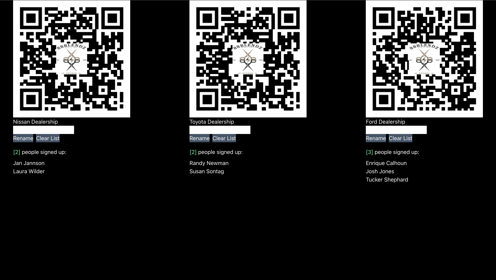

## 88Blendz Haircut Signup Sheet

Mongo, Apollo, React, graphQL

The barber for whom I built a welcome page has a business arrangement with several local car dealerships -  
on a predetermined day he or his barbers go to the car showrooms and give haircuts to the sales staffs of each, all at once for everyone's convenience.

Eventually it became difficult to know how many sales people wanted a haircut on any of the predetermined days. He called me and asked if it would be possible to get QR codes linked to a signup sheet. He would send these to his clients ahead of these visits, and they'd post them in the break room and whoever wanted a haircut could simply scan it and sign up. I built him this (well, his version is elsewhere, this is just the model):

The administrator has [this link](https://blendz-a0e7082e8ee7.herokuapp.com/) - this is what the owner of 88Blendz sees, and where he gets the QRs to send to the managers of the sales offices. He can see how many people have signed up, rename the lists as the clients change, and clear the lists to make room for new appointments. The QRs are at the top, waiting for him to copy/paste and text to his clients.

When his clients scan the codes and open the links, this is what they'll see:

[Signup List 1](https://blendz-a0e7082e8ee7.herokuapp.com/signuplist1)

or

[Signup List 2](https://blendz-a0e7082e8ee7.herokuapp.com/signuplist2)

or

[Signup List 3](https://blendz-a0e7082e8ee7.herokuapp.com/signuplist3)

all they have to do is enter their name and confirm it, and they're added to the list.
